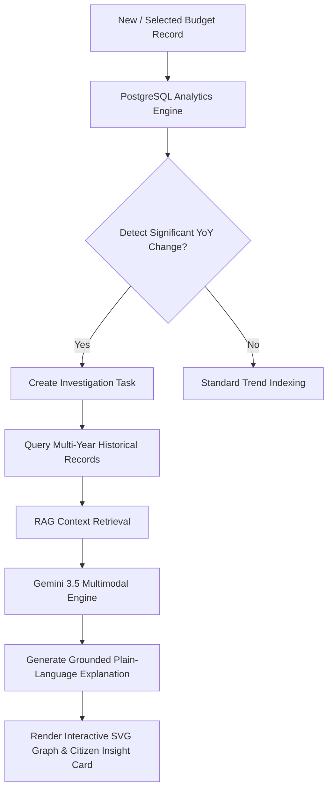
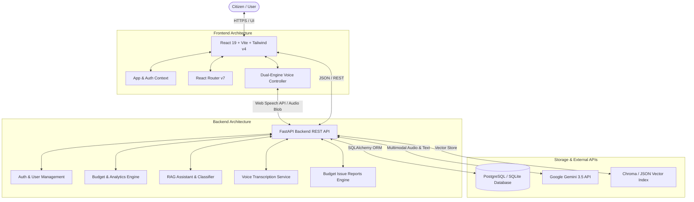

# CivicLens — Intelligent Government Budget Transparency Platform

[](https://opensource.org/licenses/MIT)
[](https://www.python.org/)
[](https://fastapi.tiangolo.com/)
[](https://react.dev/)
[](https://tailwindcss.com/)
[](https://www.postgresql.org/)
[](https://ai.google.dev/)

> **CivicLens** makes complex Indian Union Budget data simple, transparent, interactive, and accessible for ordinary citizens, students, researchers, and journalists. Powered by PostgreSQL database analytics, grounded RAG search, and agentic AI anomaly detection.

---

## 📋 Table of Contents

- [1. Project Overview](#1-project-overview)
- [2. Problem Statement](#2-problem-statement)
- [3. Our Solution](#3-our-solution)
- [4. Key Features](#4-key-features)
- [5. Agentic AI Architecture](#5-agentic-ai-architecture)
- [6. System Architecture](#6-system-architecture)
- [7. Tech Stack](#7-tech-stack)
- [8. Database Schema & Data Integrity](#8-database-schema--data-integrity)
- [9. Project Structure](#9-project-structure)
- [10. Setup and Installation (Windows Guide)](#10-setup-and-installation-windows-guide)
- [11. Environment Variables](#11-environment-variables)
- [12. API Reference](#12-api-reference)
- [13. Data Accuracy & Limitations](#13-data-accuracy--limitations)
- [14. Security & Authentication](#14-security--authentication)
- [15. Future Roadmap](#15-future-roadmap)
- [16. Team & Contributors](#16-team--contributors)
- [17. Screenshots & Demo Placeholders](#17-screenshots--demo-placeholders)

---

## 1. Project Overview

The Indian Union Budget contains thousands of pages of financial statements, expenditure tables, and departmental outlays. For ordinary citizens without background knowledge in public finance, extracting meaningful insights from official documents is exceptionally difficult.

**CivicLens** transforms raw official budget datasets into structured, interactive visual dashboards, multi-year historical trend graphs, and data-grounded AI explanations. 

By combining **PostgreSQL database queries** with **Google Gemini Multimodal AI** and **RAG (Retrieval-Augmented Generation)**, CivicLens enables citizens to:
- Understand key macro-economic indicators (Fiscal Deficit, Revenue Expenditure, Capital Expenditure).
- Search and filter **26,500+ official budget records** across Union Ministries and Departments.
- View automated **Year-on-Year spending anomaly detection** with confidence scoring.
- Ask questions in natural language (via typed text or native voice input in English/Hindi).
- Export custom official CSV datasets and PDF transparency reports.
- Raise formal citizen budget concerns through an authenticated issue reporting system.

---

## 2. Problem Statement

Government budget documents are published in dense tabular formats across multiple statements, rendering them opaque to the public:

1. **Information Overload**: Tens of thousands of individual budget heads and line items make it hard to find specific departmental allocations.
2. **Hierarchical Double-Counting**: Naively summing expenditure rows across sub-totals, major heads, and grand totals leads to mathematically impossible allocation figures.
3. **Complex Terminology**: Technical terms like *Capex*, *Revenue Deficit*, or *Revised Estimate (RE)* confuse non-financial users.
4. **Opaque Spending Changes**: Unexplained multi-fold increases or sudden drops in departmental funding go unnoticed without automated anomaly detection.
5. **Lack of Grounded QA**: General AI chatbots often invent or hallucinate numeric budget figures instead of querying official records.

---

## 3. Our Solution

CivicLens bridges the gap between complex government financial data and citizen transparency:

```
┌─────────────────────────────────────────────────────────────────────────────┐
│                          CIVICLENS PLATFORM FLOW                            │
└─────────────────────────────────────────────────────────────────────────────┘
  Official Union Budget Records (FY 2018-19 to 2024-25)
                          │
                          ▼
        PostgreSQL / SQLite Database Storage (26,585 Records)
                          │
     ┌────────────────────┼────────────────────┐
     ▼                    ▼                    ▼
[ Analytics Engine ] [ RAG Vector Store ] [ Agentic Anomaly Detector ]
  (Canonical Totals,   (PDF Statements,     (YoY Spike & Drop Detection,
   YoY Trends)          Budget Speeches)     Confidence Classification)
     │                    │                    │
     └────────────────────┼────────────────────┘
                          ▼
            FastAPI Backend REST Service
                          │
     ┌────────────────────┴────────────────────┐
     ▼                                         ▼
[ React 19 Frontend ]                   [ Dual-Engine Voice AI ]
 (Tailwind v4 UI,                        (Web Speech API + MediaRecorder
  Interactive Graphs,                     Gemini 3.5 Audio Fallback)
  Glossary Modals)
```

---

## 4. Key Features

### 🏛️ 1. Budget at a Glance
- **Key Financial Cards**: Displays **Total Recorded Allocation**, **Revenue Expenditure**, and **Capital Expenditure** formatted strictly in Indian Crore (`₹ XX,XX,XXX Cr`).
- **Canonical Aggregation**: Applies strict SQL filtering (`row_type = 'department'`) to prevent hierarchical double-counting across major budget heads.
- **Category & Department Distributions**: Visual breakdown of Central Sector Schemes, Centrally Sponsored Schemes, Establishment Expenditure, and Finance Commission Grants.
- **Multi-Year Trends**: View historical allocations across **FY 2018-19** through **FY 2024-25**.

### 🔍 2. Explore Budget
- **Real-Time Data Explorer**: Search and filter 26,500+ records by Financial Year, Ministry/Department, and Expenditure Category.
- **Clean Citizen UI**: Clean interface focused entirely on financial data transparency without exposing internal database keys or technical badges.
- **Detailed Item Breakdown**: Inspect individual line items, statements, and demand numbers.

### 📈 3. Department AI Insights
- **Significant Spending Changes**: Automatically detects multi-year spending spikes and drops using historical PostgreSQL baseline comparisons.
- **Confidence Scoring**: Classifies spending changes into **HIGH CONFIDENCE** vs. **REQUIRES SOURCE REVIEW** (flagging extreme percentage changes with low baseline amounts).
- **Interactive SVG Trend Graphs**: View multi-year outlay graphs for any selected budget entity without relying on third-party charting bloat.
- **Grounded Explanations**: Generates plain-language contextual explanations powered by Gemini 3.5.

### 💬 4. Ask CivicLens (Hybrid RAG + Voice Assistant)
- **Natural Language QA**: Ask plain-language questions like *"How much was allocated to education in 2024-2025?"* or *"Compare healthcare spending over recent years"*.
- **Data Grounding Guarantee**: System routes budget data questions directly to PostgreSQL SQL queries and vector store search, ensuring Gemini answers strictly from real records.
- **Transparent Source Badges**: Displays source indicators on every assistant response (`✓ Verified CivicLens Data`, `Budget Information`, or `AI General Response`).
- **Dual-Engine Voice Input**: Supports native browser Web Speech API (`en-IN` / `hi-IN`) with automatic fallback to `MediaRecorder` audio capture + backend Gemini audio transcription (`POST /api/voice/transcribe`).

### 📥 5. Reports & Downloads
- **Custom CSV Export**: Download filtered budget datasets based on selected financial year, department, or expenditure category.
- **Official PDF Transparency Reports**: Generate and download printable PDF budget reports directly from PostgreSQL data.
- **Live Summary Preview**: Preview total budget outlays and top line-item allocations before downloading.

### 🚩 6. Citizen Budget Concern System ("Report an Issue")
- **Raise a Concern**: Authenticated citizens can submit formal concerns regarding suspicious allocations, data discrepancies, or missing information.
- **Database Driven Dropdowns**: Prefills financial years and distinct ministries dynamically from PostgreSQL `budget_records`.
- **Anonymous Reporting Toggle**: Allows citizens to submit anonymously (displays as `"Anonymous Citizen"` in standard review listings).
- **Admin Review Portal**: Role-based Admin Dashboard interface (`/admin`) allowing administrators to review reports, assign priorities (`low`, `normal`, `high`, `urgent`), update statuses (`submitted`, `under_review`, `resolved`, `dismissed`), and save internal audit notes.

### 📚 7. Interactive Budget Glossary
- **Plain-Language Definitions**: Interactive educational cards covering key terms: *Fiscal Deficit*, *Capital Expenditure (Capex)*, *Revenue Expenditure*, *Budget Allocation*, *Subsidy*, and *Revised Estimate (RE)*.
- **In-Page Interactive Modals**: Clicking **Learn More →** opens an in-page dialog divided into 5 structured sections (*What does it mean?*, *Why does it matter?*, *Simple example*, *How it relates to budget*, *How CivicLens helps*). Does not reload the page or open new browser tabs.

### 🔒 8. Authentication & Security
- **Role-Based Access Control (RBAC)**: Secure authentication with JWT tokens separating normal `user` permissions from `admin` management capabilities.
- **Protected Routes**: Protected frontend routes using React Router navigation guards.

---

## 5. Agentic AI Architecture

CivicLens implements a structured, data-grounded **Agentic Analysis Pipeline** that inspects budget data, identifies anomalies, and generates grounded explanations:



### Agent Workflow Steps:
1. **Data Analytics**: PostgreSQL computes YoY percentage change and absolute crore differences across financial years.
2. **Anomaly Trigger**: Variations exceeding configured thresholds trigger an automated investigation task.
3. **Historical Retrieval**: System fetches multi-year baseline figures for that specific `budget_item_key` from `budget_records`.
4. **Context Augmentation**: Retrieves relevant official document chunks from the vector index.
5. **Grounded Synthesis**: Gemini API synthesizes a plain-language summary citing exact figures without hallucinating numbers.

---

## 6. System Architecture



---

## 7. Tech Stack

| Domain | Technology | Purpose / Details |
| :--- | :--- | :--- |
| **Frontend Framework** | **React 19** | Modern UI component rendering |
| **Build Tool** | **Vite 8** | Fast HMR development and production bundler |
| **Language** | **TypeScript 5.8** | Type-safe application development |
| **Styling** | **Tailwind CSS v4** | Modern utility-first responsive styling |
| **Routing** | **React Router v7** | Client-side routing with protected navigation guards |
| **Backend Framework** | **FastAPI 0.110** | High-performance asynchronous REST API |
| **Server Engine** | **Uvicorn** | ASGI web server |
| **Database** | **PostgreSQL / SQLite** | Relational storage for 26,585 budget records & users |
| **ORM / Database Tools**| **SQLAlchemy 2.0** | Python Object Relational Mapper |
| **Validation** | **Pydantic 2.6** | Data validation & settings management |
| **AI Provider** | **Google Gemini API** | Multimodal LLM (`gemini-3.5-flash`, `gemini-3.5-flash-lite`) |
| **Voice AI** | **Web Speech API & MediaRecorder** | Native browser STT with backend Gemini audio fallback |
| **Report Generation** | **Custom CSV & Report Engine** | Dynamic CSV export and PDF report synthesis |

---

## 8. Database Schema & Data Integrity

CivicLens uses three primary relational tables in PostgreSQL:

### 1. `budget_records` (26,585 Official Records)
Stores Union Budget allocations across **FY 2018-2019** to **FY 2024-2025**:
- `record_id` (BigInteger, PK): Primary key identifier.
- `financial_year` (String): e.g., `'2024-2025'`, `'2023-2024'`.
- `amount_stage` (String): Budget Estimate (BE), Revised Estimate (RE), Actuals.
- `ministry_department` (String): e.g., `'Ministry of Education'`.
- `expenditure_category` (String): e.g., `'Central Sector Schemes/Projects'`.
- `budget_item` (Text): Full description of the budget head/scheme.
- `budget_item_key` (String): Normalized entity key for multi-year tracking.
- `amount` / `total_amount` (Numeric): Value formatted in Crore.
- `revenue_amount` / `capital_amount` (Numeric): Revenue vs Capital split.
- `row_type` (String): `'department'`, `'category'`, or `'item'` (used for hierarchical double-counting prevention).
- `source_file` (String): Source dataset file reference.

### 2. `users` (User Authentication)
- `id` (Integer, PK): User ID.
- `email` (String, Unique): Registered email address.
- `username` (String, Unique): Username.
- `full_name` (String): Full name.
- `hashed_password` (String): Password hash (bcrypt/PBKDF2).
- `role` (String): `'user'` or `'admin'`.
- `is_active` (Boolean): Account active status.

### 3. `budget_issue_reports` (Citizen Concern System)
- `id` (Integer, PK): Issue report ID.
- `user_id` (Integer, FK `users.id`): Submitting citizen user ID.
- `is_anonymous` (Boolean): Anonymous toggle flag.
- `issue_category` (String): Category of concern.
- `financial_year` / `ministry_department` / `budget_item`: Relational context.
- `issue_title` / `description` / `evidence_reference`: Citizen input details.
- `status` (String): `'submitted'`, `'under_review'`, `'needs_information'`, `'resolved'`, `'dismissed'`.
- `priority` (String): `'low'`, `'normal'`, `'high'`, `'urgent'`.
- `admin_notes` / `reviewed_by` / `reviewed_at`: Admin audit fields.

---

## 9. Project Structure

```
CivicLens/
├── backend/
│   └── backend/
│       ├── app/
│       │   ├── models/
│       │   │   ├── budget.py          # BudgetRecord SQLAlchemy model
│       │   │   ├── report.py          # BudgetIssueReport SQLAlchemy model
│       │   │   └── user.py            # User SQLAlchemy model
│       │   ├── routers/
│       │   │   ├── admin.py           # Admin Portal & Issue Report Management API
│       │   │   ├── analysis.py        # Analytics & YoY Trends API
│       │   │   ├── assistant.py       # Citizen Assistant RAG API
│       │   │   ├── auth.py            # JWT Authentication & RBAC API
│       │   │   ├── budgets.py         # Budget Exploration API
│       │   │   ├── investigations.py # Agentic AI Investigation API
│       │   │   ├── issue_reports.py   # Citizen Issue Reporting API
│       │   │   ├── rag.py             # Document Retrieval API
│       │   │   ├── reports.py         # CSV & PDF Generator API
│       │   │   └── voice.py           # Voice Audio Transcription API
│       │   ├── schemas/
│       │   │   ├── assistant.py       # Assistant request/response schemas
│       │   │   ├── budget.py          # Budget record schemas
│       │   │   ├── report.py          # Issue report validation schemas
│       │   │   └── user.py            # Auth schemas
│       │   ├── services/
│       │   │   ├── analysis_service.py # YoY analysis service
│       │   │   ├── assistant_service.py# Hybrid assistant logic
│       │   │   ├── auth_service.py    # Password hashing & JWT service
│       │   │   ├── budget_service.py   # Canonical aggregation service
│       │   │   ├── investigation_service.py # Agentic anomaly detector
│       │   │   ├── rag_service.py     # Document vector store service
│       │   │   ├── report_issue_service.py # Citizen report service
│       │   │   ├── report_service.py  # PDF/CSV generation service
│       │   │   └── voice_service.py   # Gemini Audio STT service
│       │   ├── config.py              # Pydantic Settings configuration
│       │   ├── database.py            # SQLAlchemy database engine & sessions
│       │   └── main.py                # FastAPI application entrypoint
│       ├── data/                      # Vector store & CSV source data
│       ├── tests/                     # Backend unittest suite (23 tests)
│       ├── .env.example               # Environment variables template
│       ├── civiclens.db               # Database file
│       └── requirements.txt           # Python dependencies
├── frontend/
│   ├── src/
│   │   ├── api/                       # REST API client modules
│   │   ├── assets/                    # Platform images & emblems
│   │   ├── components/                # Reusable React components
│   │   ├── context/                   # AppContext & AuthContext
│   │   ├── pages/                     # Main platform pages
│   │   │   ├── admin/                 # Admin Dashboard pages
│   │   │   ├── AIInsights.tsx         # Department AI Insights page
│   │   │   ├── AskCivicLens.tsx       # Hybrid Assistant page
│   │   │   ├── BudgetAtAGlance.tsx    # Key Budget Summary page
│   │   │   ├── ExploreBudget.tsx      # Budget Explorer page
│   │   │   ├── Glossary.tsx           # Interactive Glossary page
│   │   │   ├── Reports.tsx            # Reports & Issue Reporting page
│   │   │   ├── Login.tsx              # Login page
│   │   │   └── Register.tsx           # Sign up page
│   │   ├── types/                     # TypeScript definitions
│   │   ├── App.tsx                    # React Router configuration
│   │   └── main.tsx                   # React root mounting
│   ├── package.json                   # Frontend dependencies & scripts
│   ├── tsconfig.json                  # TypeScript configuration
│   └── vite.config.ts                 # Vite build configuration
└── README.md                          # Project documentation
```

---

## 10. Setup and Installation (Windows Guide)

### Prerequisites
- **Python 3.10+**
- **Node.js 18+ & npm**
- **Git**

### Step 1: Clone the Repository
```bash
git clone https://github.com/06praveen/CivicLens.git
cd CivicLens
```

### Step 2: Backend Setup
```cmd
cd backend\backend

:: Create Python Virtual Environment
python -m venv venv

:: Activate Virtual Environment
venv\Scripts\activate

:: Install Backend Dependencies
pip install -r requirements.txt
```

### Step 3: Configure Backend Environment Variables
Create a `.env` file in `backend/backend/` using `.env.example` as a reference:

```cmd
copy .env.example .env
```

Edit `backend/backend/.env` and add your Google Gemini API Key:
```env
DATABASE_URL=sqlite:///civiclens.db
POSTGRES_USER_DB_URL=sqlite:///civiclens.db
GEMINI_API_KEY=your_actual_gemini_api_key_here
SECRET_KEY=your_secure_random_jwt_secret_key
SPEECH_TO_TEXT_API_KEY=your_actual_gemini_api_key_here
```
> ⚠️ **IMPORTANT**: Never commit `.env` files containing real API keys or passwords to version control! `.env.example` contains placeholders and can be safely committed.

### Step 4: Launch Backend Server
```cmd
uvicorn app.main:app --reload --host 127.0.0.1 --port 8000
```
- API Documentation (Swagger UI): `http://127.0.0.1:8000/docs`
- Redoc UI: `http://127.0.0.1:8000/redoc`

### Step 5: Frontend Setup
Open a new terminal window:

```cmd
cd frontend

:: Install Node Dependencies
npm install

:: Start Vite Development Server
npm run dev
```
- Access Frontend Application: `http://localhost:5173` (or `http://localhost:5174`)

---

## 11. Environment Variables

| Variable | Purpose | Location | Example |
| :--- | :--- | :--- | :--- |
| `DATABASE_URL` | Main budget records database connection | Backend `.env` | `sqlite:///civiclens.db` or `postgresql://...` |
| `POSTGRES_USER_DB_URL` | User authentication storage URL | Backend `.env` | `sqlite:///civiclens.db` or `postgresql://...` |
| `GEMINI_API_KEY` | Google Gemini AI API Key | Backend `.env` | `AIzaSy...` |
| `SPEECH_TO_TEXT_API_KEY` | Audio STT transcription key | Backend `.env` | `AIzaSy...` |
| `SECRET_KEY` | JWT authentication signing secret | Backend `.env` | `super_secret_jwt_key_2026` |
| `FRONTEND_ORIGIN` | Allowed CORS origin URLs | Backend `.env` | `http://localhost:5173,http://localhost:5174` |
| `VITE_API_URL` | Backend API base URL for frontend | Frontend `.env` | `http://localhost:8000` |

---

## 12. API Reference

### 📊 Budget Exploration & Key Summary
- `GET /api/budgets/summary`: Returns Total Recorded Allocation, Revenue Expenditure, Capital Expenditure formatted in Crore.
- `GET /api/budgets/filters`: Returns distinct financial years, departments, and categories.
- `GET /api/budgets/explore`: Search budget records with pagination and filters.

### 📈 Department AI Insights & Anomalies
- `GET /api/analysis/dept-anomalies`: Multi-year spending spike & drop detection with confidence levels.
- `GET /api/analysis/item-trend`: Returns year-by-year historical trend points for any budget item key.
- `POST /api/investigations/trigger`: Executes deep-dive Agentic AI investigation on a budget item.

### 💬 Citizen RAG Assistant & Voice AI
- `POST /api/assistant/ask`: Plain-language questions routed through hybrid PostgreSQL + RAG vector store.
- `GET /api/assistant/health`: Health status of database, RAG index, and AI providers.
- `POST /api/voice/transcribe`: Accepts audio file/blob (`audio/webm`, `audio/mp4`, `audio/wav`) and transcribes via Gemini 3.5.

### 📥 Reports & Issue Management
- `GET /api/reports/options`: Returns distinct DB-driven options for issue reporting.
- `GET /api/reports/preview`: Returns preview summary for selected scope.
- `GET /api/reports/csv`: Generates downloadable CSV dataset.
- `GET /api/reports/pdf`: Generates downloadable PDF report.
- `POST /api/reports`: Submits citizen budget concern report.
- `GET /api/reports/my-reports`: Lists reports submitted by logged-in citizen.

### 🔒 Admin Portal (`Admin Only`)
- `GET /api/admin/dashboard`: System telemetry and database metrics.
- `GET /api/admin/reports`: List all citizen concern reports (supports status & priority filters).
- `PATCH /api/admin/reports/{report_id}`: Admin update for report status, priority, and internal audit notes.

---

## 13. Data Accuracy & Limitations

1. **Available Financial Years**: CivicLens currently tracks official budget records from **FY 2018-2019** through **FY 2024-2025** (7 financial years).
2. **Double-Counting Prevention**: Government budget datasets contain hierarchical line items (sub-totals, major heads, department totals). CivicLens uses explicit SQL filtering (`row_type = 'department'`) to ensure Key Budget Summaries accurately reflect non-overlapping allocations.
3. **Grounded AI Guardrails**: Ask CivicLens assistant prompts strictly mandate that AI answers must be derived from retrieved PostgreSQL records and official documents. Unrecognized budget queries are rejected with clean suggestions rather than inventing numbers.

---

## 14. Security & Authentication

- **Git Security**: `.env` files are included in `.gitignore` to prevent secret key leaks.
- **Password Protection**: Passwords are hashed before storage in the database.
- **JWT Authorization**: Session tokens are signed using `SECRET_KEY` with configurable expiration.
- **Role Verification**: Admin endpoints enforce strict role checks (`require_admin`), returning `403 Forbidden` for non-admin users.

---

## 15. Future Roadmap

- [ ] **Autonomous Data Watcher**: Automatic background ingestion & anomaly analysis when new budget CSVs/PDFs are uploaded.
- [ ] **Citizen Alert Subscriptions**: SMS and email notifications when tracked department allocations experience significant changes.
- [ ] **RTI Application Draft Assistant**: Pre-filled Right to Information (RTI) application generator based on budget discrepancies.
- [ ] **State Budget Ingestion**: Expanding beyond Union Budgets to include Indian State Government budget datasets.
- [ ] **Budget Forecasting Engine**: Predictive machine learning models for estimating future departmental spending requirements.

---

## 16. Team & Contributors

| Name | Role | Responsibilities |
| :--- | :--- | :--- |
| **Team Lead / Fullstack Developer** | Core Architecture | Fullstack React + FastAPI development, RAG & Voice AI integration |
| **Data & AI Specialist** | AI & Anomaly Detection | PostgreSQL schema design, Gemini API integration, prompt engineering |
| **UI/UX Designer** | Frontend Aesthetics | Tailwind CSS design system, accessibility, responsive UI layouts |

---

## 17. Screenshots & Demo Placeholders

| Feature Module | Screenshot Preview |
| :--- | :--- |
| **Home Page Banner** |  |
| **Budget at a Glance** |  |
| **Explore Budget Data** |  |
| **Department AI Insights** |  |
| **Ask CivicLens Voice AI** |  |
| **Reports & Downloads** |  |
| **Report an Issue System** |  |

---

## 💡 Final Project Highlight

> **CivicLens is not just a chatbot.** It is a comprehensive government budget transparency platform combining structured PostgreSQL budget data, interactive exploration, multi-year historical analytics, grounded RAG assistant capabilities, dual-engine voice AI, and citizen accountability reporting into one intuitive ecosystem.
